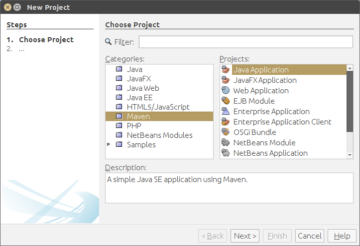
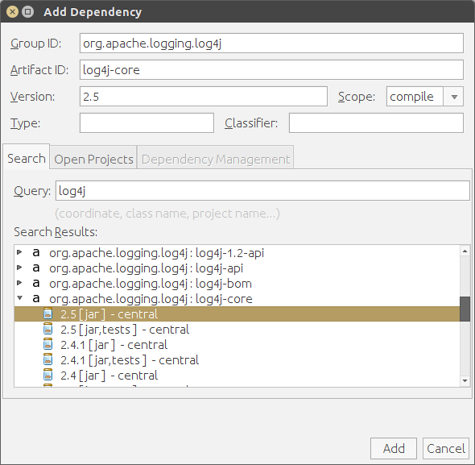
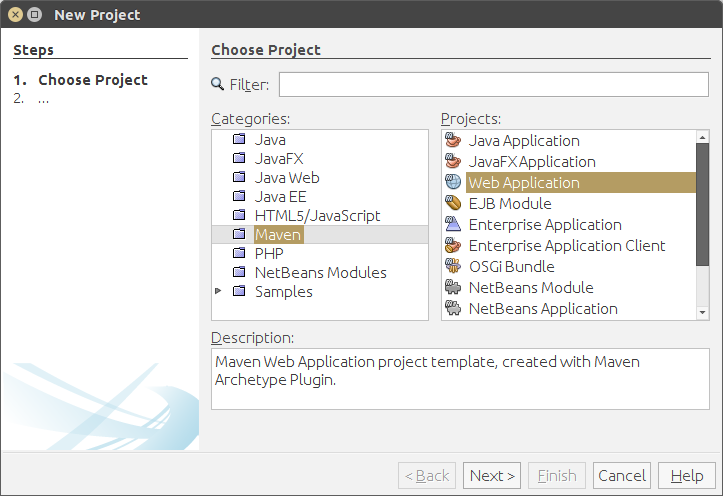
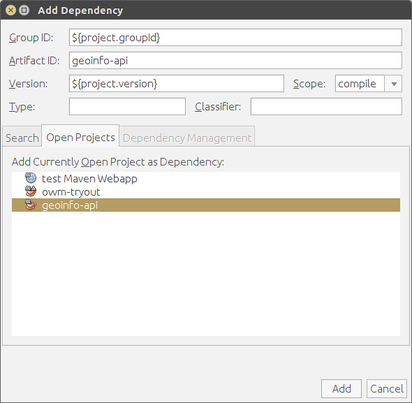

# KSwe SoSe 2016 - Aufgabe 4

Inkrementelle Entwicklung einer Software mit Netbeans und Maven. Das Projektsetup soll
mit Hilfe von NetBeans erledigt werden.

Dieses Projekt soll im Verlauf der Entwicklung Daten zu Geolokationen (z.B. Wetter, Koordinaten,
Twitter-Feeds, ...) abrufen können.

Lege zunächst ein neues Projekt an:




Füge dem neuen Projekt mit Hilfe des Kontext-Menüs die Dependency zu Log4J in der neusten Version hinzu (`log4j:log4j`)



## Inkrement 1

Ausgangspunkt ist folgende Methode:

```java
    public static void main(String[] args) {
        WeatherRetriever retriever = new WeatherRetriever();

        LOG.info(retriever);        
        try {
            Weather weather = retriever.retrieve(new City("Bochum", "Germany"));
            LOG.info(weather);
        }
        catch (UnsupportedCountryException e) {
            LOG.error("This country is not supported", e);
        }
        
        try {
            Weather weather = retriever.retrieve(new City("Sydney", "Australia"));
            LOG.info(weather);
        }
        catch (UnsupportedCountryException e) {
            LOG.error("This country is not supported", e);
        }
    }
```

Implementiere die Klassen `WeatherRetriever`, `Weather`, `City` sowie `UnsupportedCountryException` so, dass sie mit dieser
Methode kompatibel aufgerufen werden können. Du kannst hier wieder auf die OpenWeatherMap wie in [Aufgabe 3](https://github.com/bo-kswe-sose-2016/aufgabe3) zurückgreifen. Das Object `LOG` ist hier eine Instanz von `org.apache.logging.log4j.Logger`. Erstelle diese, wie [von Log4J empfohlen](http://logging.apache.org/log4j/2.x/manual/api.html). Die automatische Konfiguration ist zunächst ausreichend, es kann sich aber bereits [mit der Konfiguration beschäftigt werden](http://logging.apache.org/log4j/2.x/manual/configuration.html).

## Inkrement 2

Sorge dafür, dass nur bestimmte Länder unterstützt werden. Insbesondere soll für das Land
"Australia" innerhalb der Methode `WeatherRetriever#retrieve()` eine `UnsupportedCountryException`
geworfen werden.

## Inkrement 3

Erstelle in zweites Projekt, eine Maven Web Application. Diese zweite Projekt wird auf die Klassen des ersten Projektes zurückgreifen.

Implementiere eine Web Applikation wie in [Aufgabe 3](https://github.com/bo-kswe-sose-2016/aufgabe3), die aber nun das erste Projekt nutzt, um die Wetter-Daten abzufragen.





Nutze für das Bereitstellen des lokalen Servers wieder das `jetty-maven-plugin`. Teste dein Programm auf korrekte Funktion!

## Veröffentlichung

Stelle deine beiden Projekte auf GitHub online!
